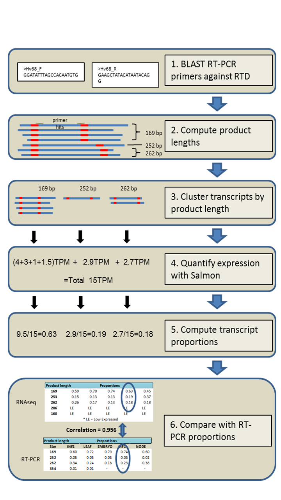

# RNA-Seq-validation

Author: Paulo Flores : 2019

Contact: Paulo.Flores@hutton.ac.uk / paulorapazote@gmail.com

<h2> Description of the algorithm </h2>

The algorithm <b>HR-RTPCR_RNA-Seq_Comparison.sh</b> is a compilation of 7 small modules, written in bash shell scripting, and associates HR-RTPCR data with a transcriptome previously quantified with SALMON. The paper (ref.) describes in detail the methodology behind the algorithm. However, below is presented more information about input and output format files, running details and also explanation about the main modules.\
\
\
 Pipeline describing the algorithm to compare HR-RT-PCR and RNA-seq alternatively spliced transcript proportions and correlations:

  

<h2>Tools and steps needed before running the algorithm </h2>

Before running the HR-RTPCR_RNA-Seq_Comparison.sh algorithm was necessary to run SALMON, a pseudo alignment tool (algorithm tested with SALMON version 0.8.2). We aligned each of our RNA-Seq read samples to the reference transcriptome (transcriptome.fasta file) after index generation. Each SALMON sample output must be in a individual folder, line 29 of the algorithm contains the path to the folder where these samples ouput should be. 

Also, it is necessary ncbi blast tool (algorithm tested with version ncbi-blast-2.2.28+), path mentioned lines 42 and 50.

The default number of processing threads is 4, however this number can be changed (algorithm lines 2 and 50). The necessary running time was around 20 minutes (transcriptome around 180 thousands transcripts and 90 primer pairs - 230 HR-RTPCR primer products). 

<h2> Input Files</h2>

Three input files are required:

1. <b>transcriptome.fasta</b> file, this file contains the transcript sequences in fasta format. The transcript headers can't contain empty spaces. Algorithm lines 20 (path to the folder where is the transcriptome) and line 22 (transcriptome file name) identify the folder location and transcriptome fasta file name used.

2. <b>PrimersSequences.fasta</b>, this file contains the primer sequences in fasta format. Each pair of primers (reverse and forward) have similar name but should have different terminations: _R (reverse) and _F (forward), example - Hv43_R and Hv43_F. 

3. <b>rtPCR_productsAndProportions.txt</b> (file located in the same folder where we run the algorithm), tab-delimited text file HR-RTPCR data. Example of the rtPCR_productsAndProportions.txt file:
        
        Primer Size Sample1 Sample2 Sample3 Sample4 Sample5
        Hv43	228	0.03	0.01	0.00	0.00	0.00
        Hv43	251	0.02	0.02	0.00	0.00	0.00
        Hv43	263	0.16	0.15	0.00	0.00	0.00
        Hv43	388	0.45	0.51	0.00	0.00	0.00
        Hv43	391	0.09	0.08	0.00	0.00	0.00
        Hv43	403	0.19	0.17	0.00	0.00	0.00
        Hv43	540	0.06	0.06	0.00	0.00	0.00 
      

 a) Column 1, <b>Primer</b> names (without _R or _F termination, example - Hv43); 

 b) Column 2, HR-RTPCR product <b>Size</b> (the calculated nucleotide distance between primer pairs);

 c) Columns 3, 4, ... contain individual sample proportions of each primer product Size;

<h2> Output Files </h2>

<b>Complete-PrimerBestPairs-data.txt</b> file contains the principal results, each line presents the transcripts identified and the best RNA-Seq product Size that is associated with the same HR-RTPCR primer product. Example of this file:

        Primer Size Sample1 Sample2 Sample3 Sample4 Sample5 Best_RNA-Seq_partner_product-size Transcripts Difference_Product-sizes Sample1 Sample2 Sample3 Sample4 Sample5 
        Hv29C 124 0.38 0.29 0.44 0.45 0.23 124 MSTRG.27957.11,MSTRG.27957.13,MSTRG.27957.15,MSTRG.27957.17,MSTRG.27957.18,MSTRG.27957.23,MSTRG.27957.4,MSTRG.27957.5 0 4.09128 4.09417 2.38327 9.74633 13.8822
        Hv29C 165 0.10 0.11 0.04 0.07 0.03 263 MSTRG.27957.12,MSTRG.27957.8,MSTRG.27957.9 98 0.160614 0.82305 1.12513 7.87256 4.71659
        Hv29C 174 0.51 0.60 0.51 0.48 0.74 174 MSTRG.27957.10,MSTRG.27957.16,MSTRG.27957.1,MSTRG.27957.20,MSTRG.27957.2,MSTRG.27957.3 0 5.09522 6.48277 8.71021 7.88991 11.0326

        Hv43C 228 0.03 0.01 0.00 0.00 0.00 357 MSTRG.18690.14 129 0 0.171198 0 0.365108 0.407714
        Hv43C 251 0.02 0.02 0.00 0.00 0.00 251 MSTRG.18690.7 0 9.36595 0.725006 1.36634 2.90935 2.21342
        Hv43C 263 0.16 0.15 0.00 0.00 0.00 263 MSTRG.18690.1 0 0 6.78275 5.09532 9.40176 12.9536
        Hv43C 388 0.45 0.51 0.00 0.00 0.00 383 MSTRG.18690.5,MSTRG.18690.9 5 15.903 27.5811 32.1096 17.6603 28.5778
        Hv43C 391 0.09 0.08 0.00 0.00 0.00 391 MSTRG.18690.3 0 8.07575 45.1946 37.6792 40.3015 35.8467
        Hv43C 403 0.19 0.17 0.00 0.00 0.00 395 MSTRG.18690.4 8 1.44373 9.41506 8.12082 8.26985 8.58011
        Hv43C 540 0.06 0.06 0.00 0.00 0.00 540 MSTRG.18690.12 0 0.693011 13.468 12.1186 10.6488 7.64003 

        Hv101C 209 0.25 0.27 0.30 0.26 0.28 209 MSTRG.29262.2 0 4.5132 0.836455 1.74505 9.55399 4.08724
        Hv101C 214 0.75 0.73 0.70 0.74 0.72 214 MSTRG.29262.1,MSTRG.29262.3 0 20.1313 27.9218 26.1369 37.7437 39.5129
        Hv104C 147 0.12 0.00 0.50 0.05 0.10 240 MSTRG.5011.4gene,MSTRG.5013.4 93 8.62283 9.84764 4.30267 9.76752 14.1962
        Hv104C 236 0.04 0.62 0.06 0.04 0.12 236 MSTRG.5011.3,MSTRG.5013.3 0 1.51951e-05 4.72146e-06 5.44597 1.1775 0.967522
        Hv104C 244 0.17 0.07 0.09 0.15 0.19 244 MSTRG.5011.2,MSTRG.5013.2 0 3.38378 1.57966 2.1378 1.83716 2.36712
        Hv104C 251 0.67 0.31 0.36 0.76 0.60 251 MSTRG.5011.1,MSTRG.5013.1 0 3.43897 5.0858 5.55545 10.5445 3.370

Columns explanation:

   a) The first columns - <b>Primer</b>, <b>Size</b> and the following 5 samples columns displays the HR-RTPCR information (also present in the <b>PCR_productsAndProportions.txt</b> file)  
   
   b) Column <b>Transcripts</b> displays the RNA-Seq transcripts, identified by the algorithm, where the primers aligned (blastn-short) perfectly. These transcripts also have the most similar product Size to the HR-RTPCR one;

   c) Column <b>Best_RNA-Seq_partner_product-size</b> shows the most similar RNA-seq product Sizes identified;

   d) Column <b>Difference_Product-sizes</b> displays the numerical difference between the HR-RTPCR product Size value and the RNA-seq one. When both product Sizes (HR-RTPCR and RNA-seq) are equal the difference is zero - a perfect match. We considered valid a maximum difference of 6 nucleotides. 

   e) All columns after <b>Difference_Product-sizes</b> present the clustered TPM values to each RNA-Seq sample. This means that all transcripts, with the same product Size were summed in terms of transcript expression in each sample. The RNA-Seq samples displayed are all samples present in the folder where SALMON quantification was performed.

Based on the information of the previous file, we calculated to each RNA-Seq gene identified the TPM expression proportions related to each product Size. After, it was possible to correlate the list of HR-RTPCR sample proportions and the computed RNA-seq proportions.    

<b>FileWithAllSampleTPMs.txt</b> contains the list of transcripts and TPM values per sample (not clustered).

<b>Other_files</b> and <b>Expression_files</b> folders contain intermediate files.

<h2> Running the algorithm</h2>

bash <b>./HR-RTPCR_RNA-Seq_Comparison.sh</b>

<h2> Description of the main steps of the algorithm (modules)</h2> 

Module 1 - Blast generates a transcriptome database with the transcriptome supplied in fasta format; The primer sequences are blasted (blastn-short) to the previous database;

Module 2 - Based on the blast alignments are identied all transcripts where the the pair of primers bind perfectly. Problematic cases are identified and filtered (partial alignments, multi-alignments, primers without target); 

Module 3 : Based on the list of transcripts identified, the levels of expression (TPM) are extracted from the different samples quantified; 

Module 4 : The product Size associated with each transcript identified is calculated; 

Module 5 : To each pair of primers, the transcripts with the same product Size are clustered in terms of levels of expression (the levels of expression are summed to each product Size);

Module 6 : The product Sizes from HR-RTPCR data and RNA-seq are compared and are established the best assocations. Sometimes the products are not exactly equal, in these case the algorithm tries to identify the nearest product Size available to form the association. When the number of product Sizes available are different there are two possible scenarios: a) an "Unknown-Partner" is reported when HR-RTPCR has more products than RNA-Seq (example: HR-RTPCR data predicted 4 products but RNA-seq only predicted 3) ; b) RNA-Seq predicted more products than HR-RTPCR (example: HR-RTPCR data predicted 3 products but RNA-seq predicted 4), in this case the remaining RNA-seq product is "Orphan" (no HR-RTPCR association available) and deposited in the file ./Other_files/Orphan-Transcripts-List.txt.        

Module 7 : Generation of final output files and folders. 

